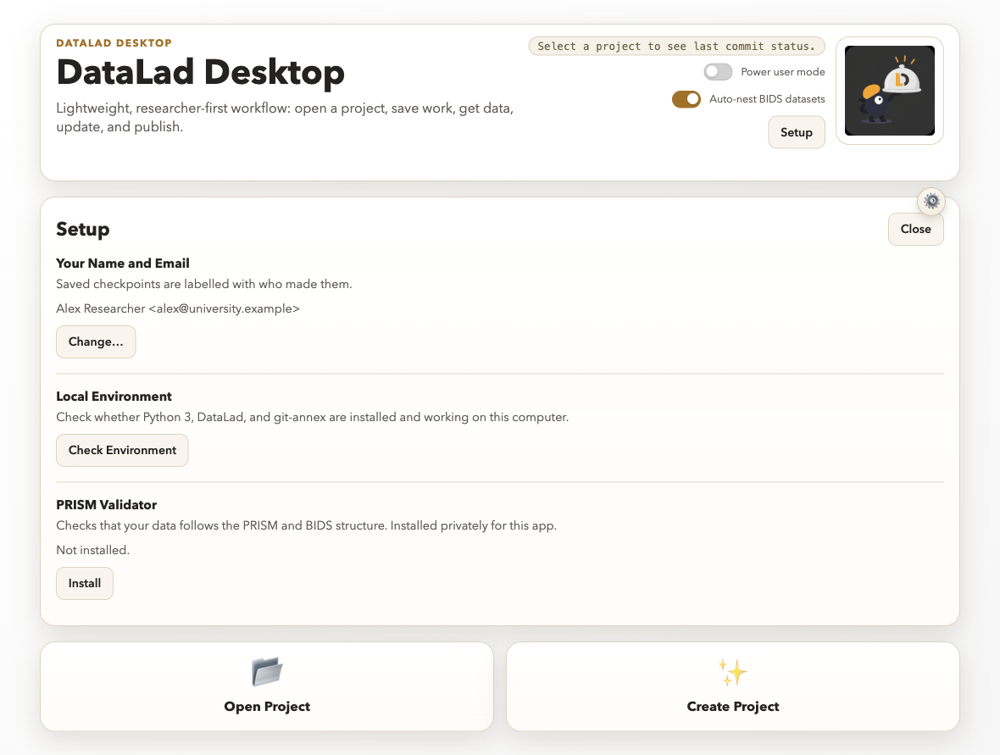

# Install & first launch

## Recommended: download the app for your OS

Most researchers should just download the ready-to-run app:

1. Go to the [Releases page](https://github.com/MRI-Lab-Graz/DataLad-desktop/releases)
   and download the build for your system:
   - **macOS (Apple silicon):** `install.sh` (see [macOS: install with a script](#macos-install-with-a-script)) or the `.dmg` file
   - **Windows:** `install.cmd` + `install.ps1` (script install, no admin rights; see
     [Windows: install with a script](#windows-install-with-a-script)), `DataLad Desktop Setup *.exe`
     (installer, needs admin rights) or `DataLad Desktop *.exe` (portable, no admin rights or install
     step — just run it)
   - **Linux:** the `.AppImage` file (make it executable, then run it)
2. Follow your platform's steps: run the script (macOS `install.sh`, Windows `install.cmd`), open the installer, or just
   run the portable build or AppImage.
3. Launch **DataLad Desktop** like any other app.

> **Windows installer:** also checks for Git, Python 3, DataLad, and git-annex and installs any
> that are missing (this needs an internet connection during setup; every downloaded installer's
> checksum is verified before it runs). If a download is blocked by your network, install the
> missing piece manually — the app's diagnostics screen will tell you exactly what's still missing.
>
> **macOS:** the `install.sh` script installs git-annex and DataLad with Homebrew; the .dmg doesn't install them, so
> use the script or install them yourself (see below).
>
> **Windows portable and Linux:** these builds don't install anything for you. To use
> DataLad-specific actions (Get Data, Update, Publish) on a project, Git, DataLad, and git-annex
> need to be installed on your system first. See [datalad.org](https://www.datalad.org/) for
> installation instructions for your platform. The app's diagnostics screen tells you what's
> missing.

**PRISM projects** (a `project.json` in the project folder) get a PRISM badge, and Save only goes through when
the PRISM validator (which includes the BIDS check) reports the whole project valid; the save that adds
`project.json` is the exception. **BIDS projects** (a `dataset_description.json` and no `project.json`) are checked
the same way before every save, with the BIDS validator. Both come with the one validator install, so there is no extra install. Files that are annexed but not downloaded do not count as errors. The
validator installs privately from **Setup → PRISM Validator** (needs internet once). To remove it on macOS/Linux, delete `~/Library/Application Support/DataLad Desktop/env` (macOS) or `~/.config/DataLad Desktop/env` (Linux); Windows uninstall removes it automatically.

## First launch: your name and email

The first time you start the app it asks for your **name and email**. They are
stored with every checkpoint you save, so teammates can see who made which change.
You enter them once; you can change them any time under **Setup → Your Name and Email**.
Until they are set, Save is blocked (choose **Later** to look around first).



## Opening a folder: the trust question

A folder the app did not create itself (one you open, clone or pick as a USB/share remote) can carry settings
and scripts that git or DataLad would run. So the first time you open one, the app shows what it found and
asks whether to trust it: **Trust this folder**, **Trust everything inside this folder** (handy for a lab share)
or **Cancel**. Nothing from the folder runs before you answer. It asks again only if something in the folder
changes. IT departments can pre-trust locations; see [SECURITY.md](https://github.com/MRI-Lab-Graz/DataLad-desktop/blob/main/SECURITY.md).

## macOS: install with a script

For Apple-silicon Macs, no administrator rights for the app, and no Gatekeeper warning (a file fetched with `curl`
is not quarantined). Open **Terminal** and paste (this is the 0.5.1 link; for another version, change the `v0.5.1` in the address):

```bash
curl -fsSL https://github.com/MRI-Lab-Graz/DataLad-desktop/releases/download/v0.5.1/install.sh | bash
```

Prefer to read it first? Download `install.sh` from the release page, then run `bash install.sh`.

The script checks the app's SHA-256 against the value baked into it, installs the app to `~/Applications`, and
installs git-annex and DataLad with Homebrew when they are missing. If Homebrew itself is missing it asks before
running Homebrew's own installer (which asks for your password). Run the script again any time to update or repair.
The log is `~/Library/Logs/DataLad Desktop/install.log`. Intel Macs: use the `.dmg` and install git-annex and DataLad
yourself (for example with `brew install git-annex datalad`).

To uninstall: `rm -rf "$HOME/Applications/DataLad Desktop.app"` (Homebrew's packages stay).

## macOS: "app can't be opened" warning

This appears for the `.dmg` (and any browser download), not for the
[script install above](#macos-install-with-a-script). Release builds aren't signed with an Apple Developer
certificate yet, so Gatekeeper blocks the first launch. **Right-click** (or Control-click)
**DataLad Desktop.app** → **Open** → **Open** in the dialog (if the dialog only
offers "Done", use **System Settings → Privacy & Security → Open Anyway**
instead). Only needed once. Or from a terminal:

```bash
xattr -d com.apple.quarantine "/Applications/DataLad Desktop.app"
```

## Windows: install with a script

For one user, without administrator rights. From the release page download **both** `install.cmd` and
`install.ps1` into the same folder and double-click `install.cmd`. It:

1. downloads the app and refuses to continue unless its SHA-256 matches the one written into `install.ps1`;
2. puts DataLad in its own private environment next to the app (hash-locked packages and its own Python; a
   Python you installed is never run) and adds that environment to **your** user PATH;
3. installs Git and git-annex only when they are missing, from pinned, checksum-verified downloads. If Git is
   installed for all users (in Program Files), git-annex needs an administrator once; the script says so;
4. adds Start-menu and desktop shortcuts.

Everything lands in `%LOCALAPPDATA%\DataLad Desktop`; the log is `DataLad Desktop install.log` next to that
folder. Start the app from the shortcut, not from a terminal that was already open, so it sees the new PATH.

From a clone of the repository, run `scripts\windows\install.cmd` instead: that copy has no release pinned, so it
installs the latest release and takes the zip's SHA-256 from that release's `SHA256SUMS.txt`. The copy from the
release page is stricter, because its hash is written into the script itself.

To upgrade, run `install.cmd` from a newer release: the old version is put back if the new one fails. To remove it,
run `%LOCALAPPDATA%\DataLad Desktop\uninstall.cmd`: it removes the app, its environment, the shortcuts and the PATH
entry, and leaves Python, Git and git-annex alone. Your projects and the app's settings are not touched.

## Windows: "Windows protected your PC" warning

Installers aren't code-signed yet, so SmartScreen blocks the first run. Click
**More info** → **Run anyway**. Only needed once.

## Advanced: install from source

This path is for contributors and advanced users who want to run the app
from the source code instead of an installer.

**Prerequisites:**

- Git
- Node.js 20+ (with npm)
- Python 3.9+
- DataLad
- git-annex

**Clone and run:**

```bash
git clone https://github.com/MRI-Lab-Graz/DataLad-desktop.git
cd DataLad-desktop
npm install
npm start
```

These commands work the same in PowerShell, cmd, or a Unix shell — there's nothing macOS/Linux-specific
about running from source.

**Windows notes:**

- Install Python from [python.org](https://www.python.org/) and make sure the **py launcher** option is
  checked. The app looks for `py -3`, then `python`, then `python3`, so the standard Windows Python install
  is detected automatically.
- Install DataLad and git-annex using the Windows installers linked from
  [datalad.org](https://www.datalad.org/) — after installing, open a new terminal so the updated `PATH`
  is picked up before running `npm start`.
- Every push to this repo runs `npm ci`, `npm test`, and a packaging smoke build on `windows-latest` in CI
  (see `.github/workflows/smoke-cross-platform.yml`), so the source install path is continuously checked on
  Windows, not just macOS.

**Run the test suite:**

```bash
npm test
```

**Build your own installer** (output goes to `dist/`):

```bash
npm run package:mac     # macOS
npm run package:win     # Windows
```

## Working with a network share

Department network shares can be used like any other folder: choose
**Create Project → Based on a remote dataset → Network Folder** and enter a
UNC path (`\\server\share\dataset`), an `smb://` URL, or a mounted share.
No SSH or server setup is involved.
